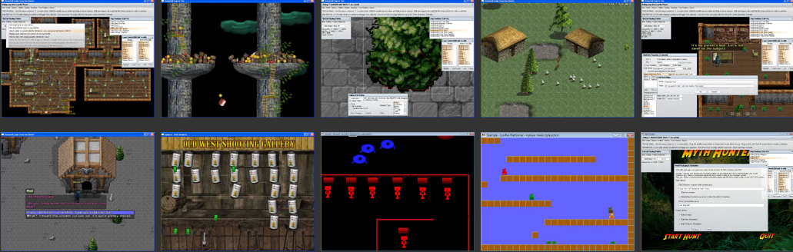

# Novashell Game Creation System
License:  BSD style attribution, see LICENSE.md

# Download the latest [Novashell V0.85 (Windows, 23 MB)](https://www.rtsoft.com/files/Novashell_Windows.zip) 

# What is Novashell?

It's an open source multi-platform 2D game engine that was first released in 2006 and discontinued in 2009.  It is not in active development and uploaded for archival & historical reasons.

  * Built in editor with multiple undo, photoshop style hotkeys
  * Lua scripting, scripts assigned to entities have their own local namespace
  * Hierarchal goal based AI and pathfinding (including pathfinding across warps and maps)
  * 2d physics (Using Box2D)
  * Comes with playable demos
  * Fully persistent live modifiable maps with save anywhere
  * Can export maps as .xml to use with Ogmo/etc
  * Full feature list [here](https://www.rtsoft.com/novashell/features.htm)
    
## What's changed as of April 4th, 2023

I cleaned up the source, updated a few things (zlib, libpng) and got it running nicely in VS2022 because throwing it on github in a broken state would just be lame.  

I don't actually recommend using it, but pretty cool for the time and I'm sad I never ended up using it for the big RPG I was dreaming of. 

In 2009 I started working on Proton SDK, a newer engine optimized for mobile devices to make iPhone games and left this by the wayside after only using it in a couple gamejams.  I learned a lot from making this engine, especially that I hate lua.

I didn't clean up the Mac/Linux builds so assume they are totally broken.

Don't be like me and waste years working on something you never use.  On the other hand, be like me and learn a ton about making engines by wasting time, it came in very handy later. -Seth

- [Novashell website](https://www.rtsoft.com/novashell/)
- [Novashell tutorials](https://www.rtsoft.com/novashell/docs/)
- [Novashell scripting reference](https://www.rtsoft.com/novashell/)

## Building from source

* Requires Visual Studio 2022+ (free "community" version is fine)

* Open Novashell.sln, build solution.  That's it.  All dependencies including Clanlib V1 are included in the project and setup for editing/debugging.

---

## Credits and links

Novashell created by Seth A. Robinson (seth@rtsoft.com) twitter: [@rtsoft](https://twitter.com/rtsoft) - blog: [Codedojo](https://www.codedojo.com)

- Particle system based on source by Wong Chin Foo (LinearParticle)
- Box2D physics by Erin Catto  (www.box2d.org)
- Pixel art used in the Top View RPG example created by Daniel Cook (www.lostgarden.com)
- Clanlib V1.0 by Magnus Norddahl, Mark Page, Kenneth Gangstoe and [more](Clanlib-1.0/CREDITS)

Additional Art:
- Akiko Robinson
- Erin McCLellan

Music: Kevin MacLeod (incompetech.com) Licensed under Creative Commons "Attribution 3.0" http://creativecommons.org/licenses/by/3.0/

gulp.ogg (with Seth's EQ change): by Oto No Happa http://www.geocities.jp/spacheeg/ (dead link.. [try here instead](http://otonohappa.web.fc2.com/eindex.html) is the new one?)